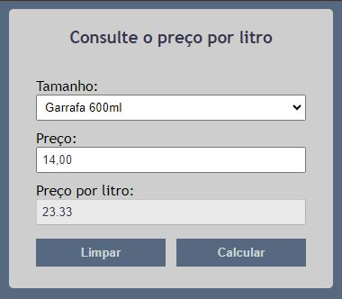

# Calculadora de Preço por Litro de Cerveja

Uma simples calculadora que permite aos usuários comparar o preço por litro de diferentes tamanhos de vasilhame de cerveja.

## Link na web

Você pode encontrar esse projeto funcionando em https://vostec.com.br/app-calcula-litro/

## Como Usar

Escolha o tamanho do vasilhame e informe o preço do mesmo: o preço por litro será calculado automaticamente, permitindo a comparação entre dois ou mais vasilhames. É útil para tomada de decisão, pois o usuário saberá a diferença de preço da mesma marca em tamanhos diferentes ou de marcas diferentes nos mesmos tamanhos.

## Exemplo

## Contribuições

Contribuições são bem-vindas! Se você encontrou algum problema ou tem uma sugestão, por favor, abra uma [issue](https://github.com/Vinicius0382/CalculaLitro/issues).

## Licença

Este projeto está licenciado sob a Licença MIT - veja o arquivo [LICENSE](LICENSE) para mais detalhes.
